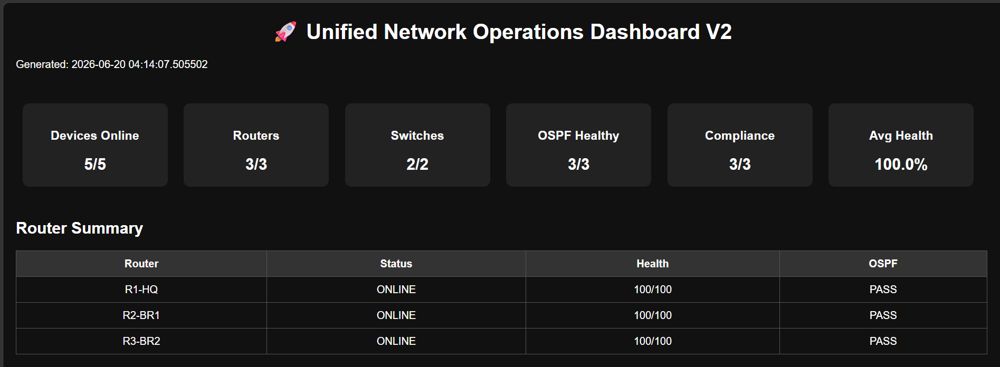
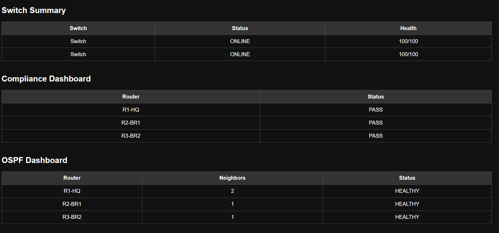
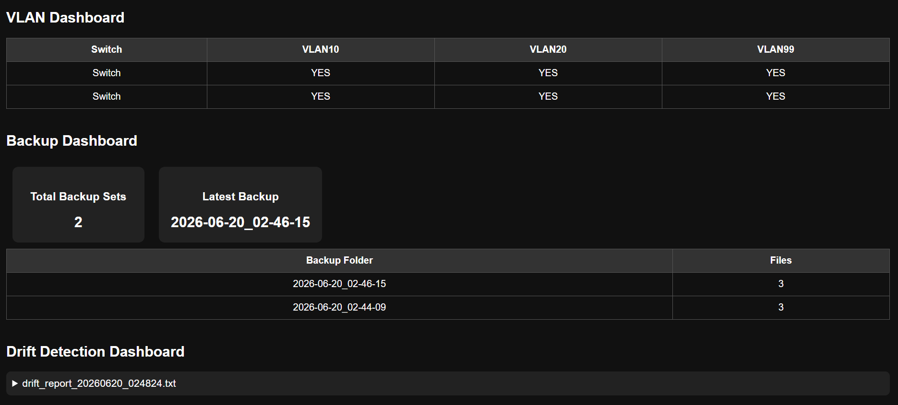
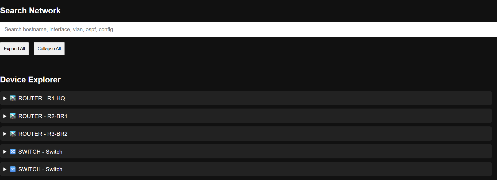

<div align="center">
  
  
  
  
  
</div>

<h1 align="center">🌐 Enterprise Network Automation & Operations Platform</h1>

<p align="center">
  <strong>A multi-branch enterprise network built in GNS3 and fully automated end-to-end with Python & Netmiko.</strong>
</p>

<p align="center">
  Covering OSPF routing, VLAN segmentation, SSH-based management, configuration backups, compliance auditing, configuration drift detection, and a unified HTML <b>Network Operations Dashboard</b>.
</p>

---

## 📖 Table of Contents
- [🚀 Overview](#-overview)
- [🖧 Network Topology](#-network-topology)
- [✨ Key Features](#-key-features)
- [🛠️ Tech Stack](#️-tech-stack)
- [📸 Dashboard Preview](#-dashboard-preview)
- [📂 Repository Structure](#-repository-structure)
- [🚀 Getting Started](#-getting-started)
- [💻 Usage](#-usage)
- [🛤️ Project Phases](#️-project-phases)
- [🔮 Future Enhancements](#-future-enhancements)
- [👨‍💻 Author](#-author)

---

## 🚀 Overview

What started as a standard CCNA-level lab has evolved into a fully-fledged **Network Operations Platform**. Instead of manually logging into devices to verify state, a robust suite of **Netmiko scripts** automatically connects to every router and switch, retrieves live operational data, and renders it into a sleek, unified dashboard.

**The Lab Scenario (ABC Company):**
- **HQ Site** and two **Branch Offices** connected via **OSPF (Area 0)**.
- Each site is segmented into specific **VLANs** for Users, Servers, and Management.
- A **Python automation layer** handles day-2 operations: config pushes, backups, drift detection, and compliance auditing against baselines.

| 🖥️ Environment | ⚙️ Details |
|---|---|
| **Lab Platform** | GNS3 (inside GNS3 VM on VMware Workstation) |
| **Devices** | 3x Cisco IOSv Routers, 2x Cisco IOSvL2 Switches, 4x VPCS |
| **Routing & Switching** | OSPF (Area 0) \| VLAN 10 (Users), 20 (Servers), 99 (Mgmt) |
| **Management** | SSH via Netmiko (`cisco_ios_telnet` initially, SSH pushed later) |

---

## 🖧 Network Topology

<p align="center">
  
</p>

**Network Subnets:**
| 📍 Site | 🌐 Subnet | 🚪 Gateway |
|---|---|---|
| **Headquarters (HQ)** | `192.168.10.0/24` | `192.168.10.1` |
| **Branch 1** | `192.168.20.0/24` | `192.168.20.1` |
| **Branch 2** | `192.168.30.0/24` | `192.168.30.1` |

*(Note: A GNS3 Cloud node bridges the Windows host machine to the lab for script access. More details in [`docs/phase3_topology_build.md`](docs/phase3_topology_build.md))*

---

## ✨ Key Features

- 🔍 **Automated Device Inventory**: Automatically collects and categorizes all routers and switches.
- 💾 **Scheduled Backups**: Reliable, timestamped configuration backups.
- ❤️ **OSPF Health Checks**: Monitors neighbor adjacencies with clear pass/fail reporting.
- 🛡️ **Compliance Auditing**: Enforces baselines (hostnames, local admins, SSH v2, OSPF presence, encrypted passwords).
- 🔌 **Interface Monitoring**: Tracks real-time up/down status per interface.
- 🚀 **VLAN Deployment**: Automated zero-touch VLAN provisioning via Netmiko `send_config_set`.
- 📊 **Drift Detection**: Automatically spots configuration drift between any two backup periods.
- 🖥️ **Unified Operations Dashboard (V2)**: A dark-themed, responsive HTML dashboard featuring live status cards, health scoring, compliance tables, drift viewer, and an interactive device explorer.

---

## 🛠️ Tech Stack

<div align="center">
  
  
  
  
  
  
  
  
</div>

---

## 📸 Dashboard Preview

The flagship component of this project is the **Unified Network Operations Dashboard V2**. It runs asynchronously across all devices, pulling everything it needs, and outputs a stunning static HTML dashboard.

<details>
  <summary><b>Click to expand Dashboard Screenshots</b></summary>
  
  <br/>
  <b>1. Overview & Status Cards</b>
  <p align="center"></p>

  <b>2. Switch Compliance & OSPF Health</b>
  <p align="center"></p>

  <b>3. VLAN, Backups & Drift Analysis</b>
  <p align="center"></p>

  <b>4. Device Search & Explorer</b>
  <p align="center"></p>
</details>

---

## 📂 Repository Structure

```text
Network-Automation-Platform/
├── 📄 Network_Automation.gns3                     # The main GNS3 lab project file
├── 📁 configs/           # Router & switch config templates/files
├── 📁 scripts/           # Python automation logic
│   ├── 📁 inventory/     # Device collection
│   ├── 📁 backups/       # Backup automation
│   ├── 📁 monitoring/    # OSPF, interfaces, and compliance scripts
│   ├── 📁 automation/    # VLAN deploy & config drift scripts
│   └── 📁 dashboard/     # Unified Operations Dashboard generator
├── 📁 backups/           # ⏳ Generated at runtime
├── 📁 drift_reports/     # ⏳ Generated at runtime
├── 📁 reports/           # ⏳ Generated at runtime (HTML dashboard lands here)
├── 📁 screenshots/       # Project evolution media
├── 📁 docs/              # Detailed phase-by-phase documentation
├── 📁 topology/          # Architecture diagrams
├── 📄 requirements.txt   # Python dependencies
└── 📄 README.md          # You are here!
```

---

## 🚀 Getting Started

### 1️⃣ Prerequisites & Lab Setup
- **GNS3 + GNS3 VM** running on VMware Workstation.
- **Python 3.11+** installed on your host machine.

### 2️⃣ Import the Lab
1. **Provide Images:** You must legally obtain your own Cisco IOSv and IOSvL2 images (e.g., from a CML subscription) and import them into your GNS3 VM.
2. **Open Project:** Open the provided `Network_Automation.gns3` project file within GNS3 to load the full multi-branch topology. The devices should map to your imported images.
3. **Verify Access:** Ensure SSH is enabled with a local admin account configured on every router and switch in the lab.

### 3️⃣ Install Dependencies
```bash
pip install -r requirements.txt
```

### 3️⃣ Update Device Connection Details
Each script inside the `scripts/` directory defines its own `routers` / `switches` list (host, port, device type). Update these IP addresses and ports to match your GNS3 topology exposures.

---

## 💻 Usage

It is highly recommended to run any script directly from inside the `scripts/` folder so that relative paths (`../backups`, `../reports`) resolve perfectly.

```bash
cd scripts

# 1. Run Core Operations
python inventory/inventory.py
python backups/backup_configs.py

# 2. Run Audits & Monitoring
python monitoring/ospf_health_check.py
python monitoring/compliance_audit.py
python monitoring/interface_monitor.py

# 3. Run Automation Scenarios
python automation/deploy_vlans.py
python automation/config_drift.py

# 4. Generate the Dashboard
python dashboard/network_operations_dashboard_v2.py
```
> 🎉 **Pro Tip:** Open the generated `reports/network_operations_dashboard_v2.html` in your favorite web browser to view the final result!

---

## 🛤️ Project Phases

We documented our journey from zero to automated! Check out the phase docs below:

| 📅 Phase | 📝 Description |
|:---:|---|
| [**Phase 1**](docs/phase1_requirements_and_setup.md) | GNS3 / VMware setup & Cisco IOSv image installation. |
| [**Phase 2**](docs/phase2_planning_and_design.md) | Topology design, IP/VLAN addressing, automation planning. |
| [**Phase 3**](docs/phase3_topology_build.md) | Building the lab, SSH bring-up, and IP reachability. |
| [**Phase 4**](docs/phase4_automation_scripts.md) | The Netmiko automation scripts (backups, OSPF, drift). |
| [**Phase 5**](docs/phase5_dashboard_evolution.md) | Evolution to the Unified Network Operations Dashboard V2. |

---

## 🔮 Future Enhancements

We're always looking to improve! Potential future directions:
- [ ] 🌐 **Live Flask Dashboard** with auto-refresh capabilities.
- [ ] 🔔 **Slack/Email Alerts** for compliance drops or OSPF neighbor failures.
- [ ] ⏱️ **Scheduled Execution** (Cron / Task Scheduler) for zero-touch backups.
- [ ] 🗺️ **Dynamic Topology Visualization** layer.
- [ ] 🐙 **Git-Based Version Control** for network configurations.
- [ ] 🔌 **REST API** exposing the underlying inventory and health data.

---

## 👨‍💻 Author

Built and documented by **Mayur Garje** as a flagship CCNA-level network automation project, seamlessly combining **Cisco IOS, GNS3, Python, and Netmiko**.

<div align="center">
  <i>If you found this project helpful, don't forget to give it a ⭐!</i>
</div>
