# Phase 1 — Requirements & GNS3 Setup

This phase covers getting GNS3 running in a stable, VMware-backed environment and installing the Cisco device images the rest of the lab depends on.

## Hardware & Software

The lab was built on a Windows host running VMware Workstation Pro, with the GNS3 VM handling all device emulation (so the host's CPU/RAM is what actually matters, not the host OS's native virtualization). Recommended specs for this kind of lab are roughly 16 GB RAM and a 4-core CPU at minimum, with more headroom making the 3-router / 2-switch / 4-PC topology run noticeably smoother.

Software used: GNS3 (2.2.59), the GNS3 VM appliance, VMware Workstation Pro, Python 3.11+, and VS Code for editing the automation scripts.

## Enabling Virtualization

Before the GNS3 VM would boot, a few Windows features had to be turned on — Virtual Machine Platform, Windows Hypervisor Platform, and Windows Subsystem for Linux — alongside VMware's own virtualization engine setting for the VM.

  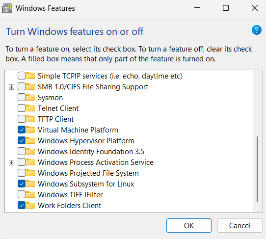

One issue hit along the way: VMware Workstation reported that virtualized Intel VT-x/EPT wasn't supported on the host, which blocks nested virtualization for the GNS3 VM. The workaround was continuing without it (with a performance trade-off) rather than a hardware fix.

  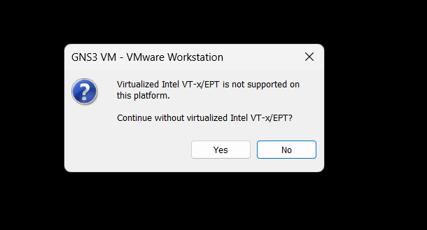

The GNS3 VM itself was allocated 4 GB RAM and 4 processor cores in VMware's VM settings.

  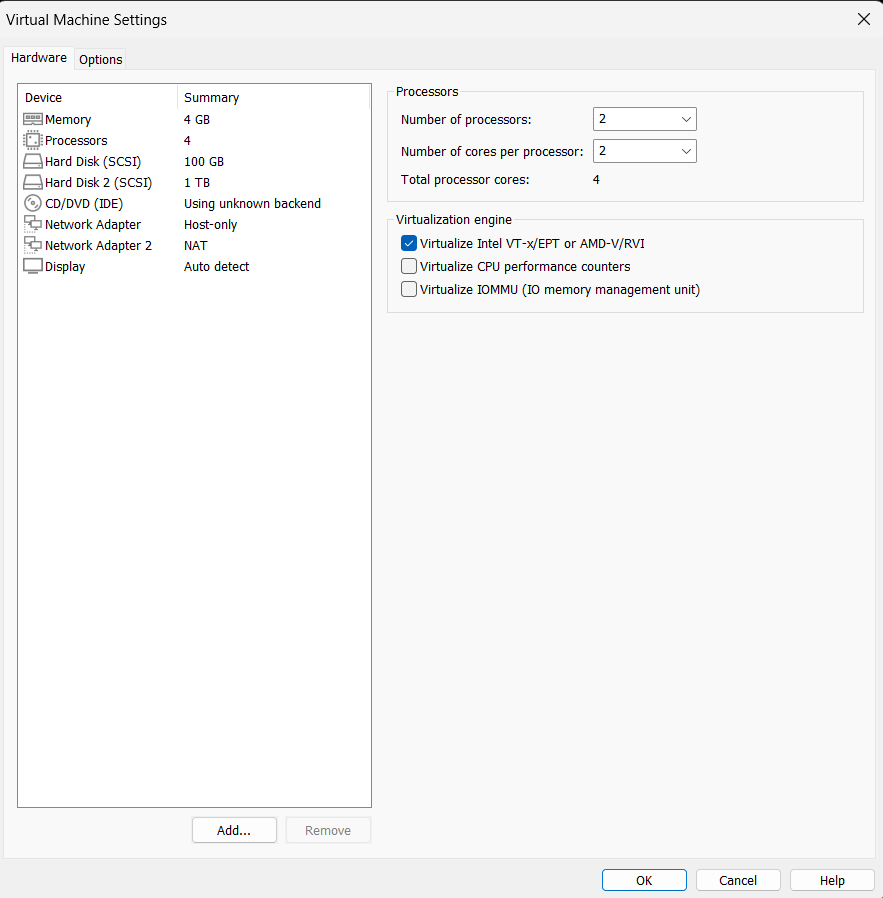

## GNS3 VM Networking

The GNS3 VM communicates with the GNS3 desktop client over a host-only VMware network (VMnet1). This network adapter and its subnet were confirmed in VMware's Virtual Network Editor before booting the VM.

  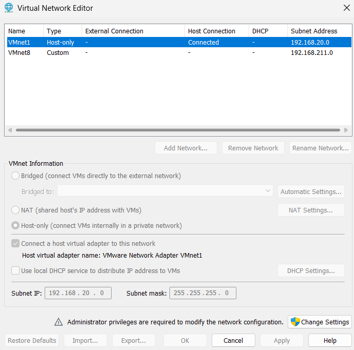

Once booted, the GNS3 VM picked up an address on that host-only network and reported it directly on its console, along with the SSH and Web UI access details:

  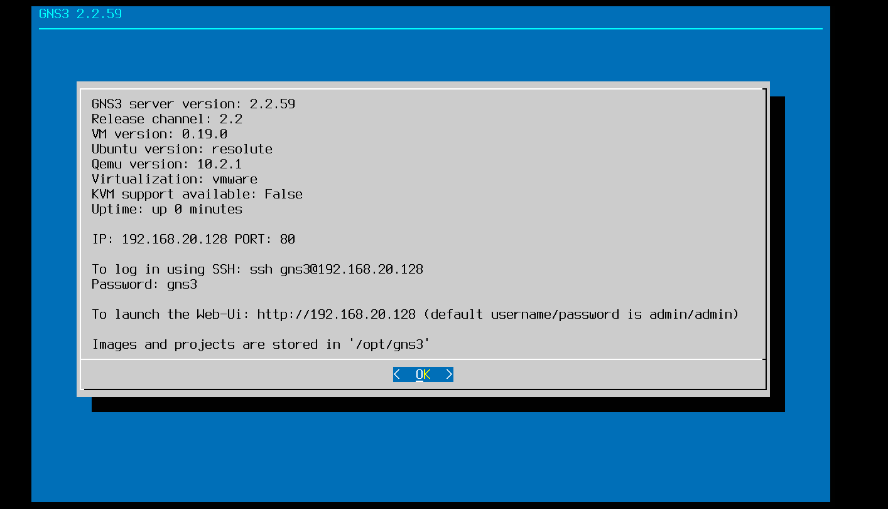

## Connecting GNS3 to the VM

In GNS3's preferences, the GNS3 VM was enabled as the virtualization engine (VMware Workstation), with vCPU/RAM allocation set for the VM server itself:

  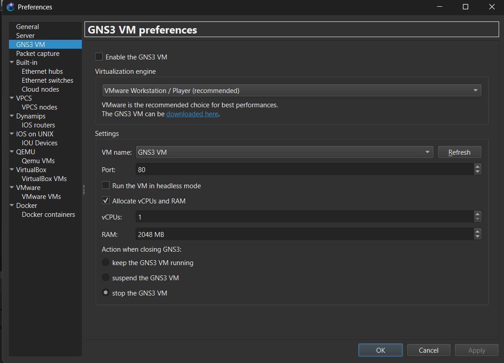

The local GNS3 server preferences (port 3080, the console port range used for telnet access to lab devices, and the UDP tunneling range) were left mostly at GNS3 defaults:

  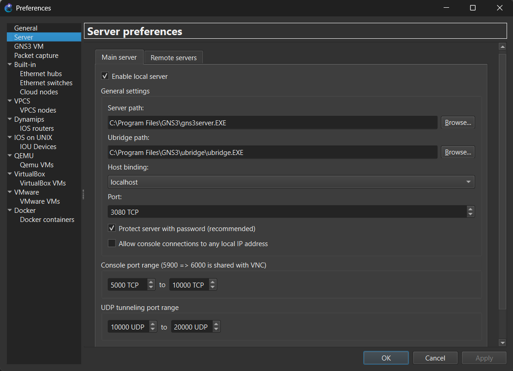

**Troubleshooting note:** at one point GNS3 timed out trying to save settings to the VM ("Operation timeout" on a PUT request to `/v2/gns3vm`), which usually points to a firewall/antivirus blocking the local connection rather than a GNS3 configuration problem.

  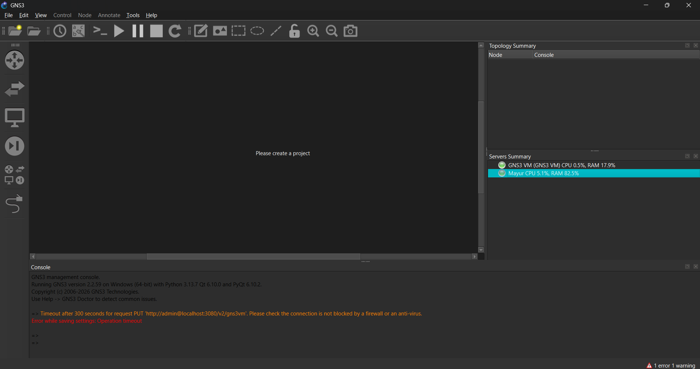

## Installing the Cisco Device Images

Two Cisco images were needed: `vios-adventerprisek9-m` for the routers (Cisco IOSv) and `vios_l2-adventerprisek9-m` for the switches (Cisco IOSvL2). These were registered in GNS3 as QEMU VM templates.

For the router template, the wizard runs through: choosing to run the QEMU VM on the local computer,

  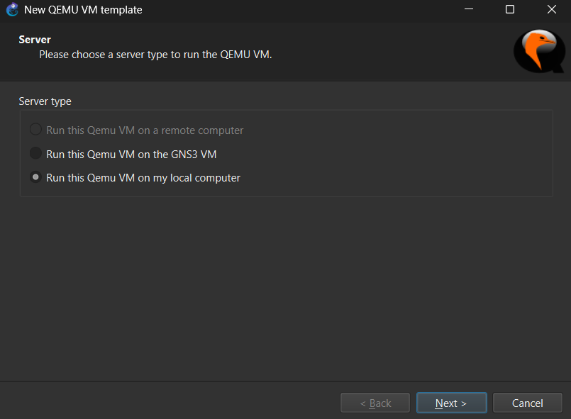

naming the template,

  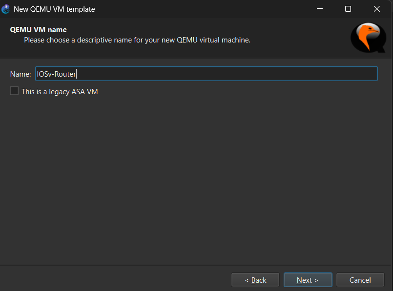

confirming the QEMU binary and RAM allocation,

  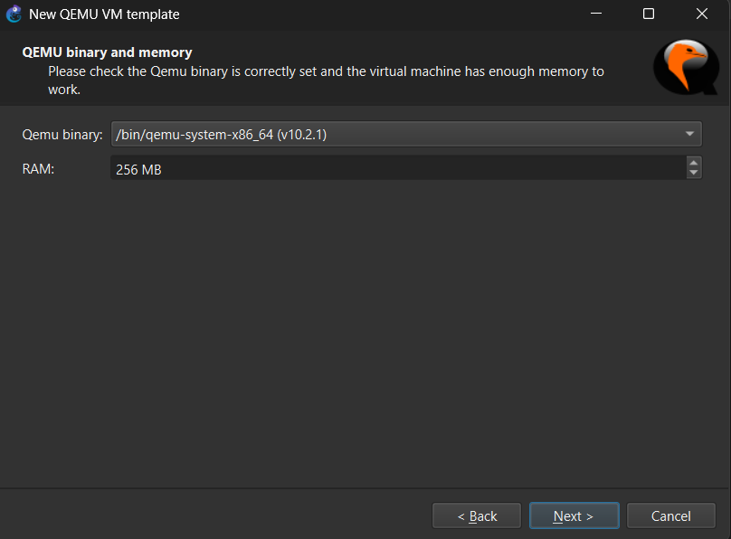

setting the console type to telnet (so GNS3 can hand out a telnet port per device for console/automation access),

  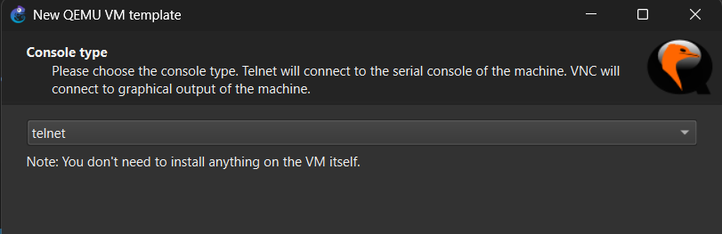

and pointing the template at the actual `vios-adventerprisek9-m` disk image:

  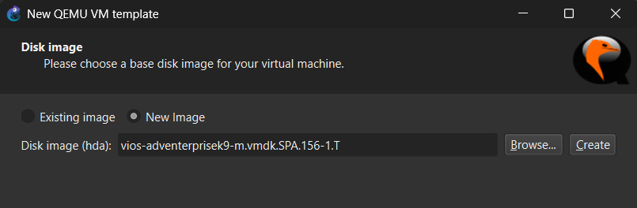

One detail that mattered for the topology: the default template only ships 1 network adapter, which isn't enough once a router needs to connect to a parent link, a sibling router, and a switch. The adapter count was bumped to 6 on the finished template so every router has enough interfaces to wire up the full topology.

  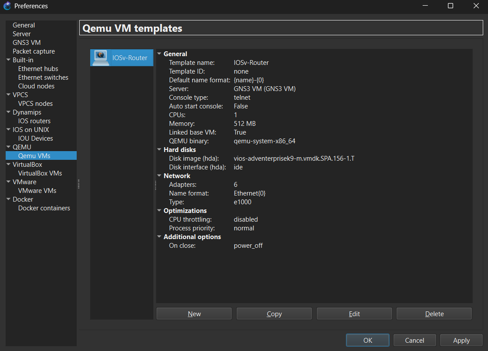

The same process (with the `vios_l2-adventerprisek9-m` image) was repeated for the switch template.

## Next

With GNS3, the GNS3 VM, and both device templates working, the next step was designing the actual topology and addressing plan — covered in [Phase 2](phase2_planning_and_design.md).
