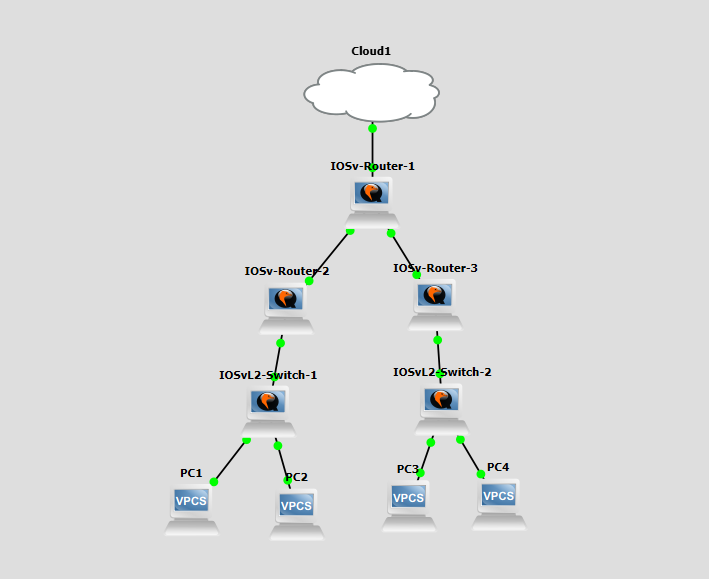
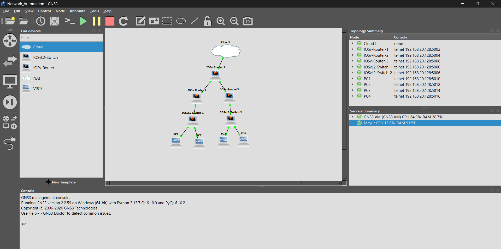
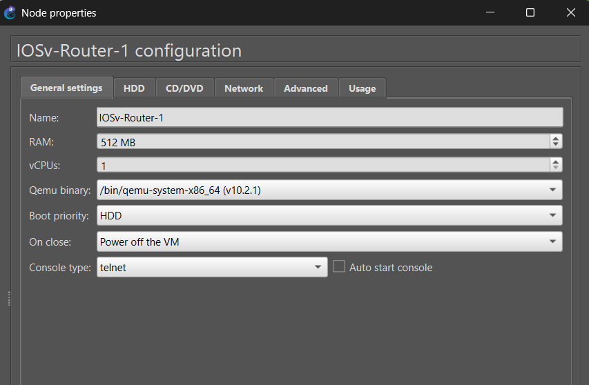
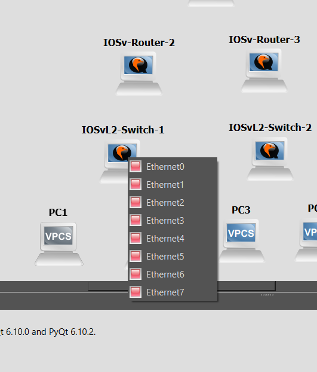
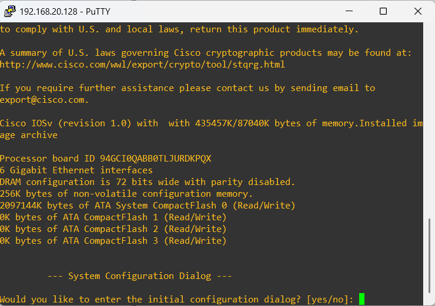
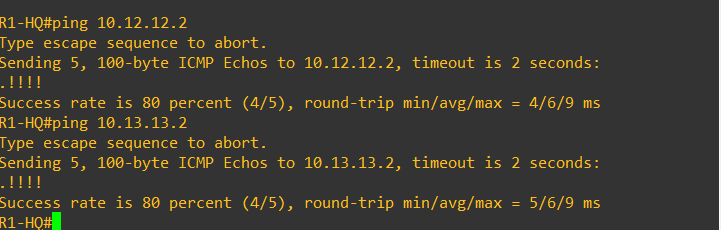
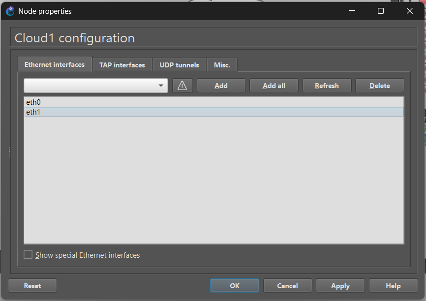

# Phase 3 — Building the Topology

With the design settled, this phase covers placing the nodes in GNS3, wiring them up, bringing devices online, and confirming basic IP reachability before any automation touches them.

## Final Topology

  

The finished canvas in GNS3, with every node started and the Topology Summary panel listing each device's assigned telnet console port:

  

## Devices Used

3x routers (Cisco IOSv, using the `IOSv-Router` template from Phase 1), 2x switches (Cisco IOSvL2), and 4x VPCS end hosts — two per branch switch.

Each router node carries its own RAM/vCPU/console settings, set per device:

  

## A Note on Interfaces

Cisco IOSv in GNS3 doesn't expose interfaces as `g0/0`, `g0/1`, etc. when you go to wire up a cable — GNS3 shows them as a flat list, `Ethernet0` through `Ethernet7`, and GNS3 maps those onto the router's actual `GigabitEthernet0/x` numbering once it boots. This tripped things up briefly until it was clear that `Ethernet0` in the GNS3 cable picker corresponds to `GigabitEthernet0/0` on the device itself, `Ethernet1` to `GigabitEthernet0/1`, and so on.

  

## Bringing Devices Up

Both routers and switches go through a standard IOS boot — here's a switch coming up on the IOSvL2 image for the first time, dropping into the initial configuration dialog:

  

SSH was then enabled on every router and switch (hostname, domain name, local admin account, RSA key generation, VTY login local + `transport input ssh`) so that the Netmiko scripts in Phase 4 would have something to actually connect to.

## Verifying Reachability

Before any automation ran, basic IP reachability between sites was confirmed manually — here, R1-HQ pinging both branch routers' OSPF-learned addresses:

  

## On the GNS3 Cloud Node

The topology also includes a GNS3 Cloud node bridging one of the host's network adapters into the lab:

  

This Cloud node isn't a network design feature — its only job is letting the Windows host (and the Python scripts running on it) reach the lab's telnet/SSH ports for automation and dashboard generation. For that reason it's kept in the working GNS3 project file but left out of the topology diagram shown in the README and in resume/interview material, where it would just be noise. It's worth mentioning if asked directly: *"A GNS3 Cloud node was used to provide management connectivity between the host machine and the virtual network devices, enabling Python/Netmiko-based automation and dashboard generation."*

## Next

With SSH up on every device and reachability confirmed, [Phase 4](phase4_automation_scripts.md) covers the actual Netmiko automation scripts.
