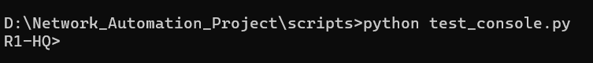
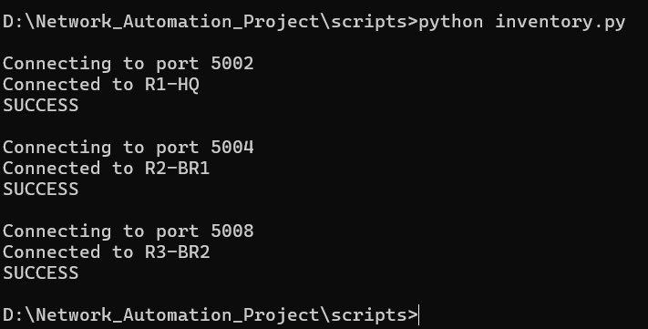
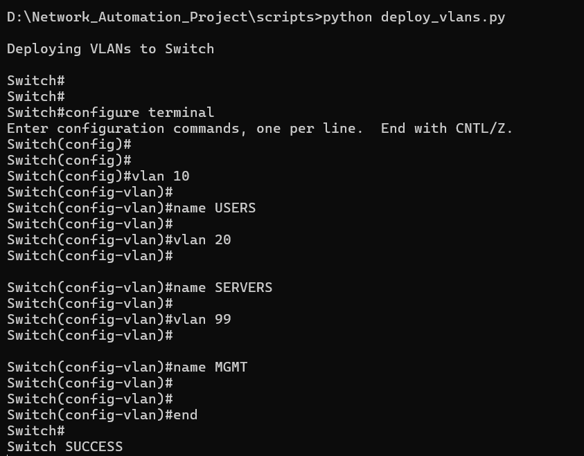
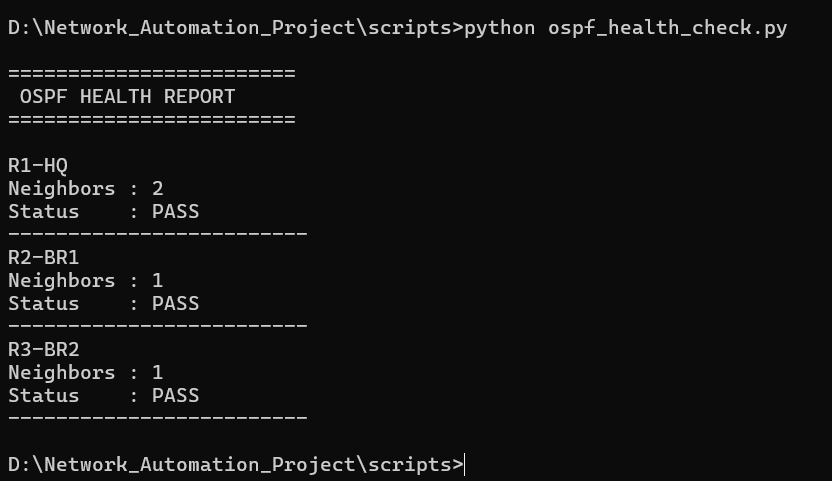
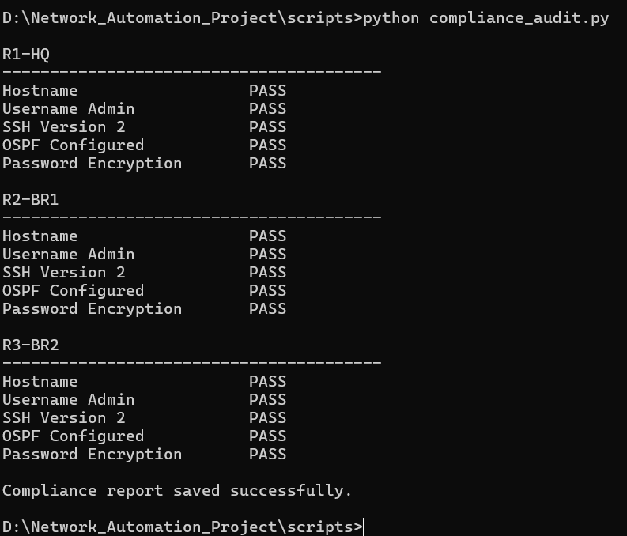
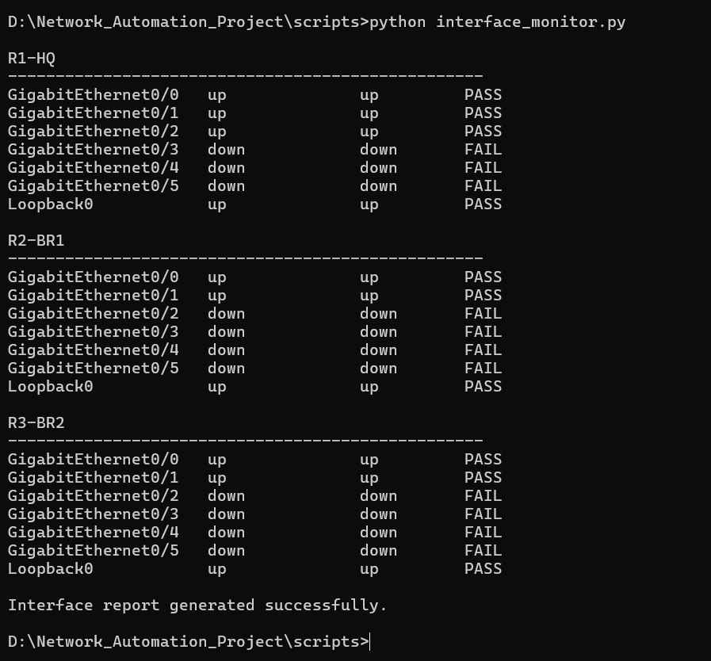
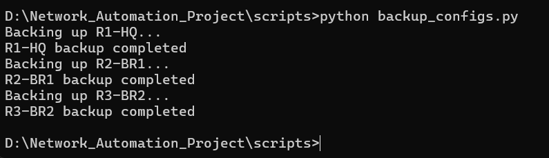
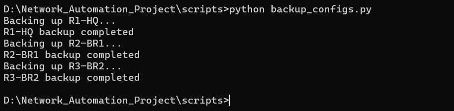
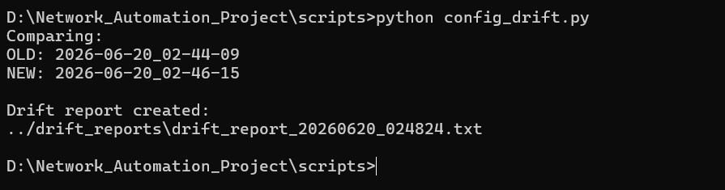

# Phase 4 — Netmiko Automation Scripts

This phase is the actual automation layer: a set of standalone Python scripts, each doing one job from the Phase 2 task list, all built around Netmiko's `ConnectHandler`. Every script connects to the routers and/or switches over the lab's telnet console ports, runs the relevant `show`/config commands, and prints or saves a report.

## Connectivity Test

Before writing anything more complex, a minimal script confirmed Netmiko could open a session and reach a device prompt:

  

## Inventory Collection — `inventory.py`

Connects to every router in turn and confirms a successful session before pulling device data:

  

## VLAN Deployment — `deploy_vlans.py`

Pushes the VLAN plan from Phase 2 to a switch via `send_config_set` — creating VLAN 10 (USERS), VLAN 20 (SERVERS), and VLAN 99 (MGMT) in one configuration session:

  

## OSPF Health Check — `ospf_health_check.py`

Runs `show ip ospf neighbor` against each router, counts FULL neighbor adjacencies, and reports pass/fail per device:

  

## Compliance Audit — `compliance_audit.py`

Checks each router against a small baseline — hostname set, local admin account present, SSH version 2 enabled, OSPF configured, and password encryption on — and saves a compliance report:

  

## Interface Monitoring — `interface_monitor.py`

Walks each router's interfaces and flags which are up versus down, which is also how the lab's intentionally-unused interfaces (the ones with nothing cabled to them) show up as expected failures rather than real problems:

  

## Configuration Backups — `backup_configs.py`

Pulls `show running-config` from every router and saves it to a timestamped folder under `backups/`. This script gets run repeatedly over time — here are two separate runs, a few minutes apart:

  

  

## Configuration Drift Detection — `config_drift.py`

Compares any two backup folders and writes out a drift report describing what changed between them. Run against the two backup sets above:

  

## Next

Each of these scripts produces useful data on its own, but reading them one at a time isn't how you'd actually want to monitor a network day to day. [Phase 5](phase5_dashboard_evolution.md) covers how they were brought together into a single dashboard.
