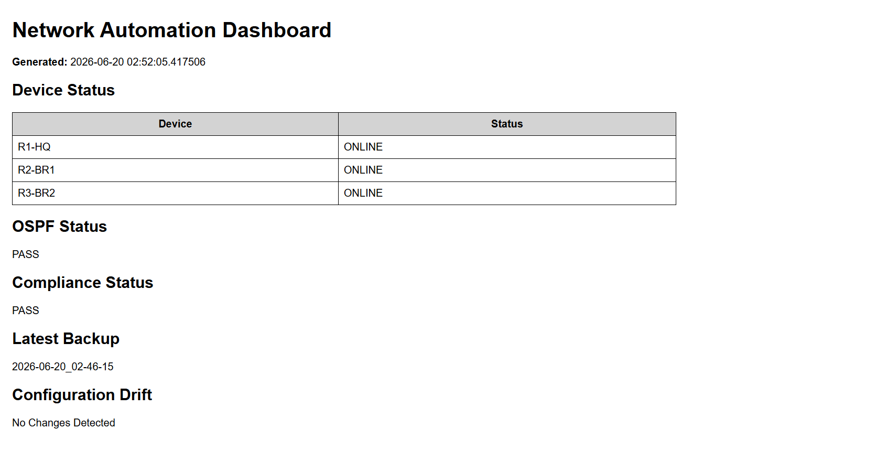
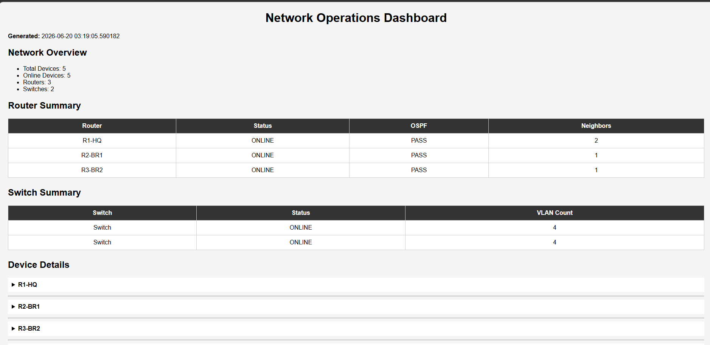
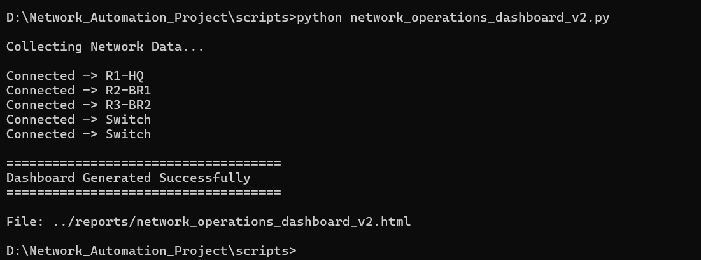

# Phase 5 — From a Status Table to the Unified Dashboard V2

The individual scripts in Phase 4 each print their own report, but checking five different terminal outputs every time isn't a real operations workflow. This phase covers how those scripts were consolidated into a single HTML dashboard, in stages.

## Where It Started

The first version was deliberately simple: one script connecting to the routers, pulling status/OSPF/compliance/backup/drift information, and rendering it as a plain HTML table.

  

## Adding Structure

As more checks were added, the single table grew into a proper "Network Operations Dashboard" page — a network overview summary, separate Router Summary and Switch Summary tables, and a collapsible Device Details section per device:

  

By this point, the project had split into four separate dashboard modules — a health/scoring dashboard, a device explorer with search, a compliance/OSPF/VLAN operations dashboard, and a backup/drift dashboard — each tested independently before being merged.

## The Merge — Unified Network Operations Dashboard V2

Rather than literally concatenating the four modules' code, the merge was done properly: connect to every device **once**, collect everything needed across all four modules into a single set of dictionaries, and generate one HTML page from that. This cut the total code size by roughly 40% compared to running all four scripts separately, and avoids reconnecting to the same device repeatedly.

Running the merged script connects to all five devices in one pass and writes a single dashboard file:

  

The resulting dashboard opens with live status cards (devices online, OSPF health, compliance, average health score) followed by the Router Summary table:

  

Below that, the Switch Summary, Compliance Dashboard, and OSPF Dashboard:

  

Then the VLAN Dashboard, Backup Dashboard (with backup history), and the Drift Detection viewer with expandable per-file diffs:

  

And finally a search box that filters the device list live, plus an expand/collapse-all Device Explorer with full interface, OSPF, VLAN, and running-config detail per device:

  

## What V2 Covers

By the time the merge was finished, the platform covered: automated inventory collection, configuration backups, OSPF monitoring, compliance auditing, interface monitoring, VLAN deployment automation, configuration drift detection, and all of it surfaced through one unified HTML dashboard.

## Where This Could Go Next

The next logical upgrades — not built as part of this version — would be a live Flask dashboard with auto-refresh instead of a static HTML snapshot, email/Slack alerting when compliance or OSPF checks fail, scheduled backups via cron/Task Scheduler, a topology visualization layer, Git-based configuration version control, and a small REST API in front of the collected data.
